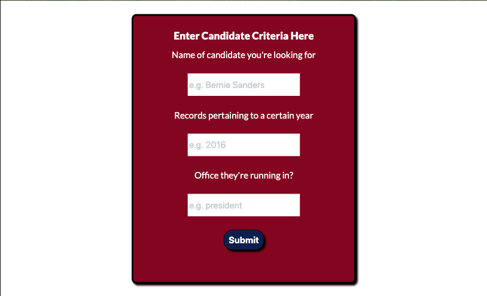
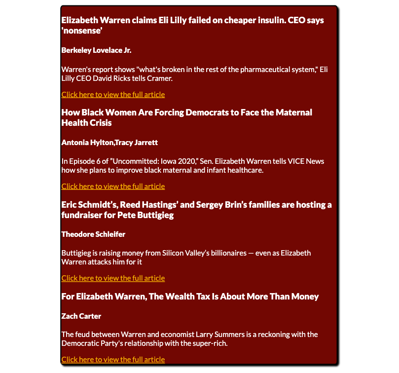

# GovInformed :us:

- Access information about your favorite candidates election history and read headline news to stay politically enlightened.
  You can access the website [here](https://oliviadavis593.github.io/govInformed/).

# Project ScreenShots :camera:

 | |
|:---:|:---:|
| Homepage |Candidate Form|

|  |  |
|:---:|:---:|
| News Form | News Results |

# Project Summary :page_with_curl:

- I designed this app with the intention of enabling people to further explore the history of a particular candidate.
- The user should be able to enter in one of the two forms at a times, and enter expected criteria - in order to retrieve either a candidates history or look up recent headline news for that said candidate. 

# Technology Used :books:

- HTML5 
- CSS3
- Javascript
- jQuery
- Government API (FEC)
- NewsAPI (NewsAPI)
- Utilized responsive design for Mobile, Desktop, and Tablet devices. 

